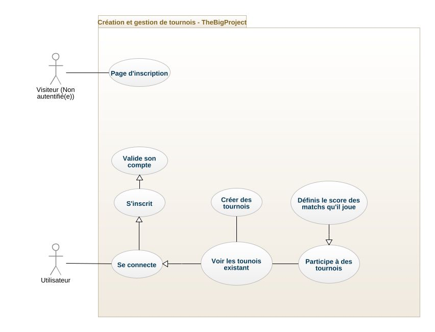

# TheBigProject | Documentation Fonctionnelle  - Theo MENCHON

Projet de fin d'année de Bachelor SUPDEWEB 3 Développement

---

## **Sommaire**
  - [Introduction](#introduction)
  - [Objectifs / Difficultés rencontrées](#objectifs--difficultés-rencontrées)
  - [Fonctionnalités](#fonctionnalités)
  - [Technologies utilisées](#technologies-utilisées)
  - [Motivation des choix technologiques](#motivation-des-choix-technologiques)
  - [Les Routes](#les-routes)
  - [Diagramme de cas d'utilisation](#diagramme-de-cas-dutilisation)
  - [Conclusion](#conclusion)

---

## **Introduction**

Découvrez l'application TheBigProject dédiée à la création de tournois de jeux vidéo ! Organisez et participez à des compétitions palpitantes dans une multitude de jeux. L'interface conviviale vous permet de créer des tournois personnalisés et d'inviter des joueurs. Suivez les résultats en temps réel, consultez les classements et interagissez avec une communauté passionnée. Rejoignez-nous dès maintenant pour vivre l'excitation des tournois de jeux vidéo !

---

## **Objectifs / Difficultés rencontrées**

En tant que développeur de cette application, mon objectif était de créer une plateforme complète pour les tournois de jeux vidéo. Malheureusement, en raison de contraintes technique comme par exemple l'envoie de mail en local depuis MACOS est bloqué et de certaines fonctionnalités qui m'ont demandé plus de temps que prévu ou certaines fonctionnalités que j'ai jugé plus importante, quelques caractéristiques n'ont pas pu être intégrées. Cependant, je suis fier de ce que j'ai pu développer :

Tout d'abord, j'ai créé une page publique respectant les bonnes pratiques SEO afin d'assurer une visibilité l'application. Ensuite, j'ai mis en place un système sécurisé de création de compte et de connexion pour les utilisateurs, garantissant ainsi la confidentialité de leurs données.

Une fonctionnalité essentielle que j'ai réussi à développer est la création de tournois. Les utilisateurs peuvent facilement organiser des compétitions dans différents jeux et personnaliser les paramètres selon leurs préférences (Nombre de joueurs maximum, jeu, et date de dérouler du tournoi).

De plus, j'ai intégré la possibilité pour les joueurs de déclarer les résultats des parties directement dans la visualisation des tournois, permettant ainsi un suivi en temps réel des performances et des classements. J'aurais aimé mettre en place le bracket du tournoi afin que les utilisateurs puissent visualisation les différentes étapes mais j'ai préféré faire tout l'aspect logique du tournoi.

Enfin, j'ai développé la fonction de génération du tableau de compétitions, facilitant ainsi la visualisation des matchs à venir et des prochaines étapes du tournoi.

Malheureusement, en raison de problèmes techniques et de contraintes de temps, certaines fonctionnalités n'ont pas pu être réalisées. Cela inclut l'invitation de participants externes par envoi de mails, ainsi que la clôture de l'événement avec un reporting détaillé aux participants. 

Malgré ces limitations, j'espère que les fonctionnalités existantes offriront une expérience agréable aux utilisateurs, en leur permettant d'organiser et de participer à des tournois de jeux vidéo passionnants. Je reste ouvert à de futures améliorations et mises à jour pour enrichir davantage cette application.

---

## **Fonctionnalités**

- Une page publique respectant les bonnes pratiques SEO
- La création de compte sécurisé et connexion des utilisateurs
- Création de tournois
- Invitation de participants externes par envoie de mails
- Génération du tableau de compétitions
- Déclaration des résultats des parties dans l'applications par les joueurs
- Clôture de l'événement avec reporting aux participants

---

## **Technologies utilisées** 
  
Les languages / technologies utilisé(e)s pour le développement :
- **Serveur local** : (MAMP ou WAMP)
- **Back-end** : PHP 8.2 ou plus
- **API REST** : PHP 8.2 ou plus
- **Base de données** : MySql 5.7.39 / phpMyAdmin  5.2.1
- **Front-end** : HTML5 / SCSS / VanillaJS et les requêtes AJAX

---

## **Motivation des choix technologiques**

J'ai pris la décision d'utiliser ces technologies pour renforcer mes compétences fondamentales en langages de programmation (PHP et JavaScript) avant de me lancer dans l'apprentissage de divers frameworks. En outre, ces technologies sont également utilisées dans mon travail actuel, ce qui me permet d'approfondir mes connaissances et de bénéficier plus facilement de l'aide de mes collègues développeurs.

En choisissant ces langages de base, j'ai pu développer une solide compréhension des concepts essentiels de programmation, ce qui m'a permis d'aborder plus efficacement les défis techniques lors du développement de cette application. En utilisant des langages que je maîtrise déjà, j'ai pu gagner en productivité et en confiance dans la création des fonctionnalités principales.

De plus, en travaillant avec ces technologies dans mon environnement professionnel, j'ai eu l'opportunité d'élargir mon réseau de développeurs expérimentés. Cela m'a permis de solliciter leur expertise et d'obtenir des conseils précieux tout au long du processus de développement. La disponibilité d'une aide facilement accessible a grandement contribué à surmonter les obstacles techniques rencontrés et à garantir la qualité du projet.

En somme, le choix de ces technologies a été motivé par ma volonté de renforcer mes bases dans les fondamentaux, de capitaliser sur mes connaissances existantes et de bénéficier du soutien de mes collègues. Cette approche a permis d'établir une fondation solide pour l'application et a favorisé ma progression en tant que développeur.

---

## **Les Routes**

**Routes de l'application**

- **GET / :** Renvoie la page d'accueil de l'application.
- **GET /connexion :** Affiche la page de connexion pour les utilisateurs.
- **GET /activate :** Permet l'activation du compte utilisateur.

Si un utilisateur est connecté :
- **GET /tournois :** Affiche la page principale des tournois.
- **GET /les-tournois :** Renvoie la liste de tous les tournois disponibles.
- **GET /tournois/:id :** Affiche la page du tournoi spécifié par son identifiant.

**Les routes de l'API :**

- **POST /ws/login :** Gère la connexion des utilisateurs via l'API.
- **POST /ws/users :** Permet l'ajout d'un nouvel utilisateur via l'API.

Si un utilisateur est connecté :
- **POST /ws/users :** Met à jour les informations de l'utilisateur connecté.
- **GET /ws/logout :** Gère la déconnexion de l'utilisateur connecté.

**Routes liées aux tournois :**

- **GET /ws/tournaments :** Renvoie la liste de tous les tournois via l'API.
- **GET /ws/tournaments/:id :** Récupère les informations d'un tournoi spécifique via son identifiant.
- **GET /ws/tournaments/:id/users :** Renvoie la liste des participants inscrits à un tournoi spécifique via son identifiant.
- **POST /ws/tournaments :** Permet de créer un nouveau tournoi via l'API.
- **POST /ws/tournaments/:id/join :** Gère l'inscription d'un utilisateur à un tournoi spécifique via son identifiant.

**Routes liées aux jeux :**

- **GET /ws/games/:id :** Récupère les informations d'un jeu spécifique via son identifiant.
- **PUT /ws/games/:id :** Permet de mettre à jour le score d'un jeu spécifique via son identifiant.

Ces routes permettent à mon application de gérer les fonctionnalités principales, telles que la navigation, l'authentification, la création de tournois, l'inscription des participants, la gestion des utilisateurs et la manipulation des scores des jeux. Utilisez ces routes comme référence pour comprendre comment l'application fonctionne et pour interagir avec l'API.

---
## **Diagramme de cas d'utilisation**
Voici le diagramme de cas d'utilisation qui j'ai imaginé pour le projet.

---

## **Conclusion**
En conclusion, ce projet de création d'un site dédié aux tournois de jeux vidéo a été une expérience passionnante et formatrice. Malgré les défis techniques et les contraintes de temps, j'ai pu développer des fonctionnalités clés telles qu'une page publique optimisée pour le référencement, un système de création de compte sécurisé que je n'avais jamais fait auparavant, la gestion des tournois et la déclaration des résultats des parties.

Ce projet m'a permis d'approfondir mes compétences en langages fondamentaux et de renforcer mes bases en programmation. En utilisant des technologies que je maîtrisais déjà, j'ai pu gagner en productivité et en confiance dans le développement de l'application. De plus, l'intégration de ces technologies dans mon travail professionnel m'a offert la possibilité de bénéficier de l'aide et des conseils précieux de mes collègues développeurs.

Bien que certaines fonctionnalités n'aient pas pu être implémentées en raison de contraintes, je suis satisfait du résultat global de ce projet. J'ai réussi à créer une plateforme conviviale et intuitive pour les passionnés de jeux vidéo qui souhaitent organiser et participer à des tournois compétitifs.

Ce projet m'a également permis de comprendre l'importance de la planification, de la gestion du temps et de la résolution de problèmes techniques. J'ai acquis une expérience précieuse dans le développement d'applications web et une meilleure compréhension des besoins des utilisateurs dans le domaine des jeux vidéo.

Enfin, étant moi-même joueur, ce projet a été une étape significative dans mon parcours de développement et m'a donné une base solide pour aborder de futurs projets. Je suis fier du travail accompli, c'est pourquoi je compte bien finir d'améliorer et à développer cette application même après l'avoir rendu pour offrir une expérience encore plus enrichissante aux joueurs de tournois de jeux vidéo.