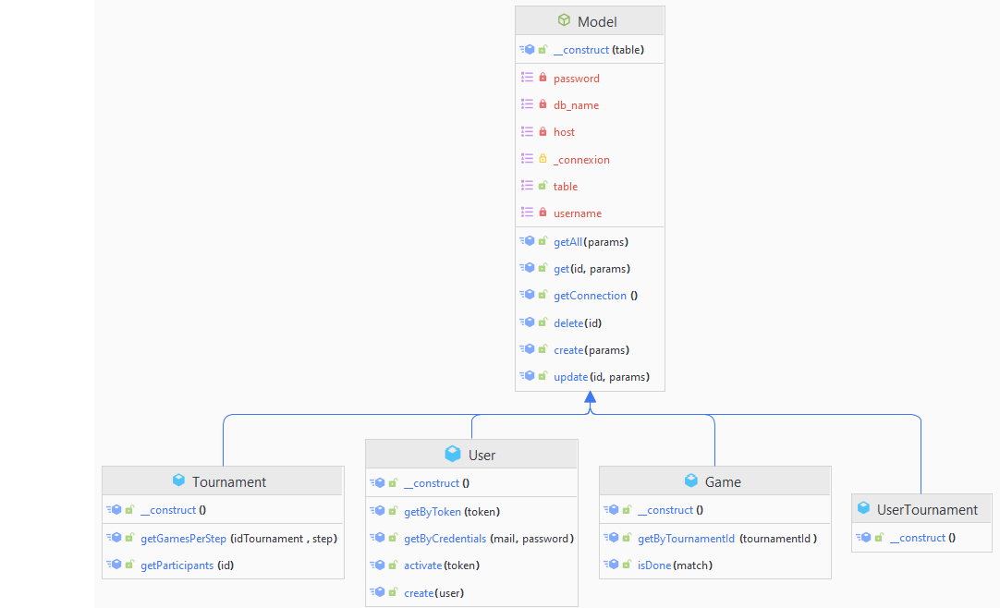
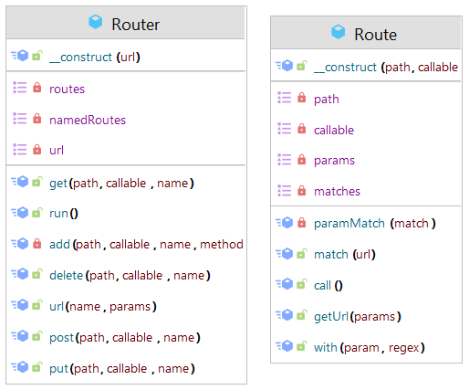

# TheBigProject | Documentation Technique

## **Introduction :**
Cette documentation technique décrit les détails techniques du système de création et de gestion des tournois de jeux vidéo. Elle est destinée aux développeurs en charge de la maintenance et de l'amélioration du système.

---

## **Architecture du système :**
Le système de système de création et de gestion des tournois de jeux vidéo est une application web développée en utilisant principalement le language **PHP 8.2**. Le système utilise une base de données **MySql 5.7.39 (minimum)** pour stocker les informations sur utilisateurs, les tournois et les matchs. Le front-end est développé en Angular.

---

## **Composants du système :**
Le système de gestion des commandes en ligne est composé des éléments suivants :

### **Serveur d'application :**

Le serveur d'application est responsable de la gestion de la logique métier de l'application et de la communication avec la base de données. Il est développé en utilisant le framework Spring et est hébergé sur un serveur Tomcat.

1. Base de données : La base de données MySQL stocke toutes les informations relatives aux commandes, aux clients et aux produits.

2. Front-end : Le front-end de l'application est développé en Angular. Il est responsable de la présentation de l'interface utilisateur et de l'interaction avec le serveur d'application.

3. API REST : Le serveur d'application expose une API REST pour communiquer avec le front-end.

---

## **Technologies utilisées :**
Les technologies utilisées pour développer TheBigProject sont les suivantes :

PHP : Le langage de programmation utilisé pour développer le serveur d'application.

JavaScript : Pour les requêtes AJAX et les animations pour le front-end.

SCSS / CSS : Pour tout le style de l'application.

MySQL : La base de données utilisée pour stocker les informations sur les utilisateurs, les tournois et les matchs.

REST : Le style architectural utilisé pour l'API entre le front-end et le serveur d'application.

---

## **Schéma de la base de données :**
Le schéma de la base de données décrit la structure de la base de données MySQL utilisée par le système de création des utilisateurs et la gestions des tournois et matchs

---

## **Diagrammes de classes de l'application**

- Diagrammes de classes des modèles :

    

- Diagrammes de classes des contrôleurs :

    

- Diagrammes de classes du système de routing :

    
---

## **Conclusion :**
Cette documentation technique fournit les détails techniques nécessaires pour comprendre et maintenir le système de gestion des commandes en ligne. Elle décrit l'architecture du système, les technologies utilisées, les composants du système et le schéma de la base de données.