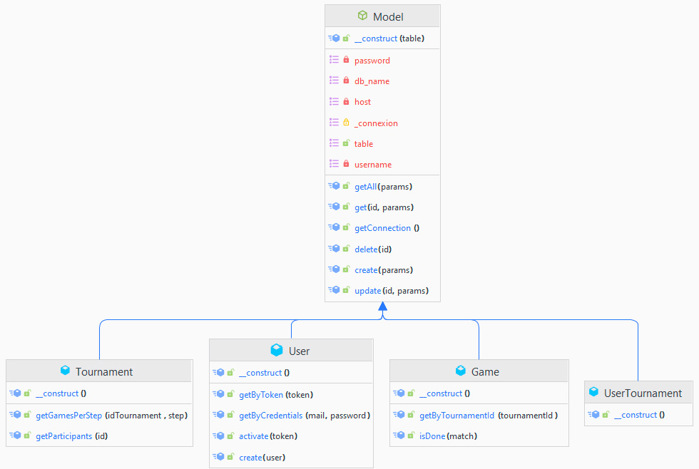
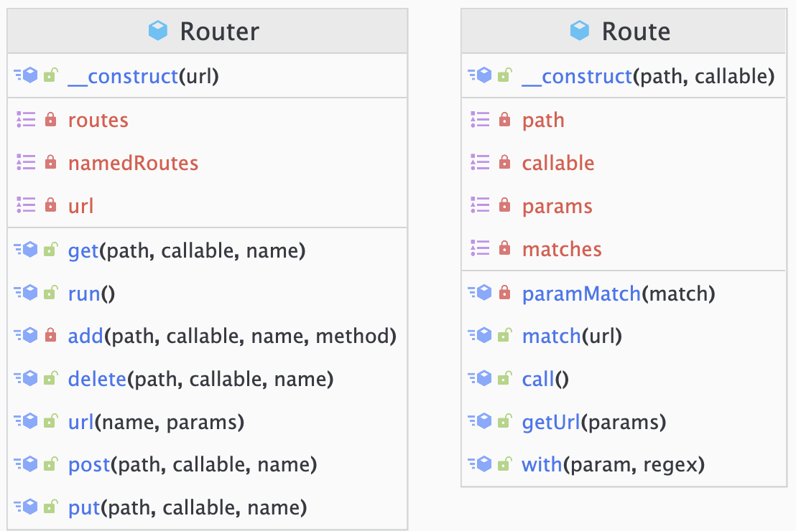

# TheBigProject | Documentation Technique - Theo MENCHON

Projet de fin d'année de Bachelor SUPDEWEB 3 Développement

---

## **Sommaire**
  - [**Introduction**](#introduction)
  - [**Architecture du système**](#architecture-du-système)
  - [**Technologies utilisées**](#technologies-utilisées)
  - [**Schéma de la base de données**](#schéma-de-la-base-de-données)
  - [**Diagrammes de classes de l'application**](#diagrammes-de-classes-de-lapplication)
  - [**Conclusion**](#conclusion)

---

## **Introduction**
Cette documentation technique décrit les détails techniques du système de création et de gestion des tournois de jeux vidéo. Elle est destinée aux développeurs en charge de la maintenance et de l'amélioration du système.

---

## **Architecture du système**
Le système de création et de gestion des tournois de jeux vidéo est une application web développé en architecture MVC **(Models, Views, Controllers)** avec en plus un dossier **app** contenant le contrôleur et le modèle générique ainsi que le système de routing qui remplace le fonctionnement par défaut de l’architecture fichier des serveurs web. J'ai aussi créé un dossier **public** contenant toutes les ressources qui doivent être accessibles.

---

## **Technologies utilisées** 
  
Les languages / technologies utilisé(e)s pour le développement :
- **Serveur local** : (MAMP ou WAMP)
- **Back-end** : PHP 8.2 ou plus
- **API REST** : PHP 8.2 ou plus
- **Base de données** : MySql 5.7.39 / phpMyAdmin  5.2.1
- **Front-end** : 
  - HTML5
  - Le préprocesseur SCSS pour générer du CSS
  - VanillaJS pour les animations et les requêtes AJAX

---

## **Schéma de la base de données**

Le schéma de la base de données décrit la structure de la base de données MySQL utilisée par le système de création des utilisateurs et la gestion des tournois et matchs

---

## **Diagrammes de classes de l'application**

- Diagrammes de classes des modèles :

- Diagrammes de classes des contrôleurs :

- Diagrammes de classes du système de routing :

---

## **Conclusion**
Cette documentation technique fournit les détails techniques nécessaires pour comprendre et maintenir l’application. Elle décrit l'architecture du système, les technologies utilisées,  le schéma de la base de données et les diagrammes de classes des contrôleurs, modèles et du système de routing.